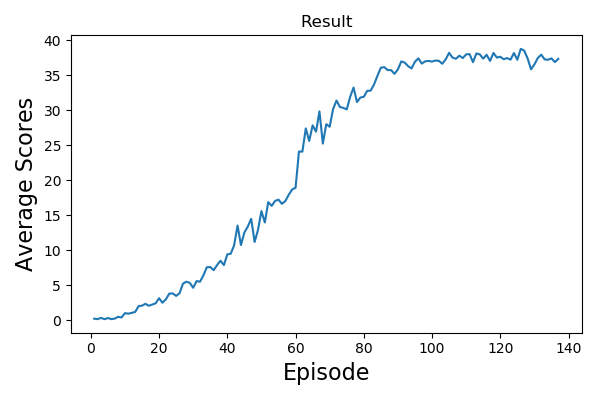

# Project2: Continous control

## Introduction
Soloving the [Unity Robit Arm Game](https://github.com/Unity-Technologies/ml-agents/blob/master/docs/Learning-Environment-Examples.md#reacher) with DRL algorithm.

In this environment, a double-jointed arm can move to target locations. The max time for each game is 1000 steps. In this project, the Reacher_One is used.  

State 
* A vector with 33 variables corresponding to position, rotation, velocity, and angular velocities of the arm.

Action
* A vector with 4 variables, ranged from -1 to +1

Reward
* +0.1 for each step that the agent's hand is in the goal location
### Project Goal: Attain average score 30+

## Setup
The workspace can be setup as following.  
`./build_env.sh`

## Run
1. To reproduce the result, run `python run.py`
2. The agent and model setting were placed at [agent.py](./agent.py)

## Implementation details
I use the DDPG algorithm to complete the task. Generally, the DDPG contains the local/target actor networks and local/target critic networks. For  
  * Actor network: the main task is to maximize q-value of the local critic network.
    * We use a local actor network to get action which is used to interact.
    * We use a target actor network to generate/evaluation the action with state_prime (s2)
  * Critic network: the main task is to minimize the TD-error between local and target critic networks
    * The local critic network is used to evaluate the action generated by actor
    * The target critic network is used to evaluate the predicted action based on target actor network
We train multiple times (num_update) for interleaved steps (time_steps) to make good use of memory.  
  
For other details, see [Report](./Report.pdf)

## Results
I do the simple experiment on adding noise or not.  
Noise Version

(Without Noise)

## Ideas for future works
I ran the experiment several times and found that the inital weight highly affect the result and training process. To reduce the unstable circumstace, a good initalization method (such as he_norm), slighly deeper network or add batch normalization to hidden layers may help a lot.
